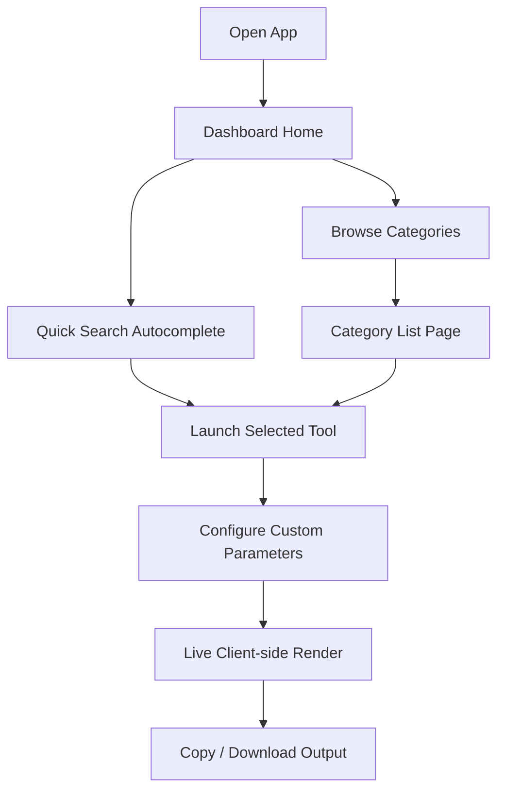

# 🚀 Generator Hub

Welcome to **Generator Hub**, a premium, modern frontend collection of multi-category generators built using **React.js**, **Tailwind CSS v4**, **React Router**, and **Framer Motion**.

The entire application operates **completely client-side** without any backend server dependencies, database queries, or external APIs. 

---

## ✨ Features at a Glance

*   **⚡ High Performance**: Instant calculation and UI rendering with zero database latency.
*   **🔒 Secure & Private**: All generation processes run strictly inside the user's browser context.
*   **📱 Responsive & Fluid**: Optimized view layouts for mobile viewports, tablets, laptops, and large desktop screens.
*   **🎨 Premium Glassmorphism UI**: Beautiful semi-transparent frosted-glass surfaces, custom neon colors, and floating animations.
*   **🌙 Dynamic Themes**: Persistence-capable dark mode matching system settings or custom manual toggles.

---

## 🛠️ Tech Stack & Dependencies

| Technology / Library | Purpose / Role |
| :--- | :--- |
| **React.js** | Declarative component framework and rendering engine |
| **Tailwind CSS v4** | Next-generation utility-first styling with `@theme` configurations |
| **React Router DOM** | Declarative page-routing system (`/`, `/:category`, `/tool/:id`) |
| **Framer Motion** | Physics-based animations for cards, slide drawers, and layouts |
| **React Icons** | Premium vector icon system |
| **qrcode** | High-performance offline canvas QR Code encoder |
| **jsbarcode** | High-performance offline barcode symbology (CODE128) encoder |

---

## 📂 Project Structure

The project has been structured according to industry standards for scalable React applications:

```bash
src/
 ├── components/           # Reusable global UI elements
 │    ├── Toast.jsx        # Glassmorphic pop-up alerts
 │    └── ToolIcon.jsx     # Dynamic mapper for FontAwesome icons
 ├── context/              # Global state providers
 │    └── AppContext.jsx   # Theme, search filter, and notification states
 ├── data/                 # Static data configurations
 │    └── toolsData.js     # Category listings and tool parameters
 ├── layouts/              # Shared structural shells
 │    └── DashboardLayout.jsx # Collapsible sidebar, header search, and footer
 ├── pages/                # Route-level pages
 │    ├── LandingPage.jsx  # Hero section, category grids, and trending widgets
 │    ├── CategoryPage.jsx # Grouped list of tools with category headers
 │    └── ToolDetailPage.jsx # Individual wrapper page mapping widgets
 ├── tools/                # Specialized generator widgets
 │    ├── PasswordGenerator.jsx
 │    ├── OtpGenerator.jsx
 │    ├── EncryptionKeyGenerator.jsx
 │    ├── NameGenerator.jsx
 │    ├── StoryTitleGenerator.jsx
 │    ├── IdeaGenerator.jsx
 │    ├── QrCodeGenerator.jsx
 │    ├── BarcodeGenerator.jsx
 │    ├── RandomNumberGenerator.jsx
 │    ├── UsernameGenerator.jsx
 │    ├── HashtagGenerator.jsx
 │    └── SocialMediaNameGenerator.jsx
 ├── App.jsx               # Entry-point router configuration
 ├── index.css             # Tailwind v4 directives and global glass tokens
 └── main.jsx              # React DOM mounting root
```

---

## 🎨 UI & Design System

### 💎 Frosted Glass Layouts
Frosted surfaces, translucent borders, and high-fidelity backdrops are applied throughout using custom CSS:
```css
.glass-effect {
  background: rgba(255, 255, 255, 0.6);
  backdrop-filter: blur(12px);
  border: 1px solid rgba(255, 255, 255, 0.4);
}
```
In dark mode, cards adapt dynamically:
```css
.dark .glass-effect {
  background: rgba(15, 23, 42, 0.55);
  border: 1px solid rgba(255, 255, 255, 0.06);
}
```

### 🌙 Dynamic Themes
The application detects system preferences (`prefers-color-scheme`) and persists overrides using `localStorage`.

### 📱 Responsive Adaptations
*   **Sidebar**: Collapses on mobile and slides in as a mobile drawer via hamburger gestures.
*   **Cards & Lists**: Transition dynamically from single-column lists on mobile to multi-column grids on wide desktop layouts.

---

## 🧩 Generator Categories & Capabilities

### 🔐 1. Security Tools
*   **Password Generator**
    *   *Features*: Length parameters (8-64), Capitalization, numbers, and symbols check, alongside a visual strength meter.
    *   *Technology*: Client-side JS randomizer.
*   **OTP Generator**
    *   *Features*: Toggle between 4-digit and 6-digit PIN codes with a cyclic 30s visual countdown authenticator timer.
    *   *Technology*: Dynamic SVG progress ring.
*   **Encryption Key Generator**
    *   *Features*: High-entropy HEX or Base64 cryptographic keys in 128, 256, and 512-bit formats.
    *   *Technology*: Native browser CSPRNG `window.crypto.getRandomValues`.

### 🎨 2. Creative Tools
*   **Name Generator**
    *   *Features*: Custom anchor keywords to generate Business, Startup, or Gaming names.
*   **Story / Title Generator**
    *   *Features*: Creates Blog Headlines, Book Titles, or Ad Hooks categorized by niche/genre.
*   **Startup & Idea Generator**
    *   *Features*: Deck layout displaying startup concepts, marketing schemes, and content inspiration.

### 🛠️ 3. Utility Tools
*   **QR Code Generator**
    *   *Features*: Text-to-QR code conversion with custom foreground/background colors and PNG downloads.
    *   *Technology*: Canvas rendering using `qrcode`.
*   **Barcode Generator**
    *   *Features*: Encodes alphanumeric values into CODE128 format barcodes with PNG download triggers.
    *   *Technology*: Canvas rendering using `jsbarcode`.
*   **Random Number Generator**
    *   *Features*: Custom range values (Min/Max), lists of unique outputs, and rolling dice delay animations.

### 📱 4. Social Tools
*   **Username Generator**
    *   *Features*: Stylish usernames blending seeds with gaming decor and leet-speak transforms.
*   **Hashtag Generator**
    *   *Features*: Expands keyword tags into Popular, Niche, and Trending lists with a bulk copy trigger.
*   **Channel Name Generator**
    *   *Features*: Suggests handle options for YouTube, Instagram, and Twitch channels tailored by niche.

---

## 🚀 Application Flow



---

## 🎞️ Framer Motion Animations

*   **Page Transitions**: Smooth slide-in entries and fade exits on route shifts.
*   **Interactions**: Micro-animations on sliders, copy buttons, and toggle checkboxes.
*   **Sidebar**: Springs open on mobile viewports.
*   **Idea Deck**: Flashcards slide in on card draws.

---

## 💻 Getting Started Locally

### Prerequisites
Make sure you have Node.js and npm installed.

### Installation
1.  **Clone the Repository**:
    ```bash
    git clone https://github.com/Gulhane-Shivani/Generator_hub.git
    cd Generator_hub
    ```
2.  **Install Dependencies**:
    ```bash
    npm install
    ```
3.  **Run Development Server**:
    ```bash
    npm run dev
    ```
    The local instance will launch on `http://localhost:5173/`.

### Production Build
To bundle the frontend for production hosting:
```bash
npm run build
```

---

## 📄 License

This project is licensed under the MIT License for educational and development practice.

---

## 👨‍💻 Author

Developed with focus on premium UI design systems, offline capability, and client-side processing.
